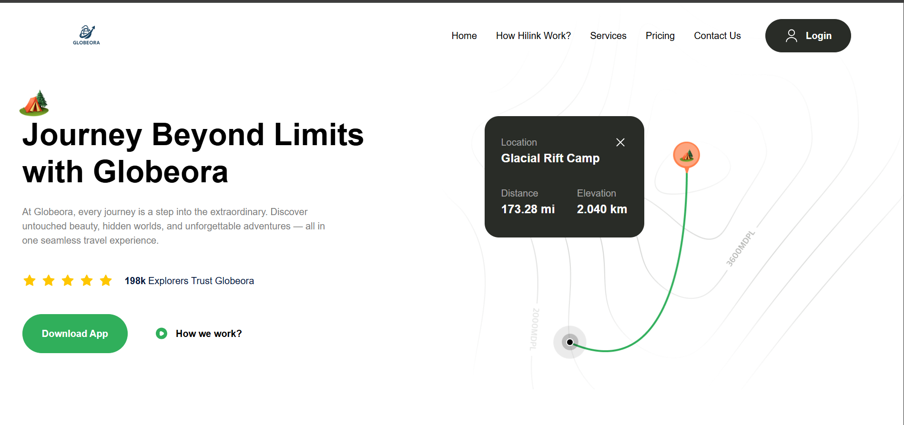

# 🌍 Globeora – Modern Animated Travel Landing Page

Globeora is a visually stunning and highly interactive travel landing page built with modern web technologies. Designed to captivate users at first glance, this project showcases smooth animations, immersive visuals, and a responsive layout, making it ideal for travel startups, agencies, or personal travel portfolios.

 

## ✨ Features

- 🎥 Smooth entrance and scroll-triggered animations using **GSAP**
- 🎨 Clean, minimalistic design with a **futuristic travel theme**
- 📱 Fully responsive – adapts perfectly to all screen sizes
- 🌐 Modern stack using **React**, **Tailwind CSS**, and **Framer Motion**
- 🧭 Interactive sections such as Hero, Campsites, Testimonials, and Explore

## 🚀 Tech Stack

- **React** – UI components & state management
- **GSAP + ScrollTrigger** – Advanced animations
- **Tailwind CSS v4** – Utility-first modern styling with OKLCH color tokens
- **Framer Motion** – Seamless animations for React components
- **Vite** – Lightning-fast build tool and dev server

## 📂 Folder Structure

```bash
Globeora/
├── public/
│   └── images/
├── src/
│   ├── assets/
│   ├── components/
│   ├── sections/
│   ├── constants/
│   ├── styles/
│   └── App.jsx
├── main.css
└── README.md

🧪 Setup & Installation
Clone the repo
git clone https://github.com/your-username/globeora.git
cd globeora
Install dependencies

npm install
Start development server

npm run dev
Build for production

npm run build

🧑‍💻 Author
Made with ❤️ by Krishna Sahu
Feel free to reach out for collaboration or freelance work.
email:krishna.sahu.work@gmail.com
📄 License
This project is licensed under the MIT License.